<div align="center">
  
</div>

<div align="center">
  
</div>

<div align="center">
  
</div>

<br/>

<div align="center">
  
  
  
  
  
</div>

<br/>

<div align="center">
<a href="https://ahmiilabs.netlify.app/"></a>
  <a href="https://ahmiilabs.netlify.app/#nexai"></a>
  <a href="https://mrahmiiportfolio.edgeone.dev/"></a>
  <a href="mailto:ahmiilabs@gmail.com"></a>
</div>

<br/>

<div align="center">

</div>


```bash
$ whoami
ZERONEX — founder, CEO & builder of AHMII LABS

$ cat roles.txt
founder · ceo · builder ....... AHMII LABS
full-stack developer .......... front-end · back-end
web & tool developer .......... websites · AI · automation
member ........................ TEAM ATHEX

$ cat studio.txt
AHMII LABS — an independent AI & software studio.
websites · AI platforms · SaaS · developer tools · automation

$ cat mission.txt
Considered code. Deliberate craft. Built for those who look twice.
```

<br/>

<div align="center">

</div>


<h2 align="center">
  
</h2>


<div align="center">
<br/>
<br/>
<br/>
<br/>
<br/>

</div>

<br/>

<div align="center">

</div>


<h2 align="center">
  
</h2>


<div align="center">
  <a href="https://ahmiilabs.netlify.app/">
    
  </a>
</div>

<br/>

<p align="center">
  An independent AI &amp; software studio that designs, builds and ships<br/>
  modern websites, AI platforms, SaaS products, custom software,<br/>
  developer tools and automation systems — from first commit to live product.
</p>

<br/>

<div align="center">


</div>

<p align="center">
  <sub>Security work is defensive and ethical only — no malware, no illegal hacking, no unauthorized access.</sub>
</p>

<details>
<summary><b>Why teams choose AHMII LABS</b> &nbsp;(expand)</summary>
<br/>
<div align="center">



</div>
</details>

<br/>

<div align="center">

</div>


<h2 align="center">
  
</h2>


<div align="center">
  <a href="https://ahmiilabs.netlify.app/#nexai">
    
  </a>
</div>

<br/>

<p align="center">
  An intelligent AI assistant built to help with productivity, coding, automation,<br/>
  content creation and everyday digital workflows — through a clean conversational interface.
</p>

<div align="center">



</div>

<br/>

<div align="center">
  <a href="https://ahmiilabs.netlify.app/#nexai"></a>
</div>

<br/>

<div align="center">

</div>


<h2 align="center">
  
</h2>


<div align="center">

| **Project** | **Category** | **Live** |
|:---|:---:|:---:|
| **Visa CRM** | Software · CRM | [Visit ↗](https://democrm.edgeone.dev/) |
| **NEX POS** | Software · POS | [Visit ↗](https://nexpose.edgeone.dev/) |
| **NexHouse** | Portfolio project | [Visit ↗](https://nexhouse.edgeone.dev/) |
| **DemoNex AI** | Portfolio project | [Visit ↗](https://demonexai.edgeone.dev/) |
| **Azunex Studio** | Portfolio project | [Visit ↗](https://azunexstudio.edgeone.dev/) |
| **Demo Website** | Portfolio project | [Visit ↗](https://demowebsite11.edgeone.dev/) |
| **AHMII Portfolio** | Personal portfolio | [Visit ↗](https://mrahmiiportfolio.edgeone.dev/) |

</div>

<p align="center">
  <sub>More at <a href="https://ahmiilabs.netlify.app/">ahmiilabs.netlify.app</a> and <a href="https://github.com/mrz3ron3x">github.com/mrz3ron3x</a></sub>
</p>

<br/>

<div align="center">

</div>


<h2 align="center">
  
</h2>


<div align="center">

**Front-End**<br/>


**Back-End**<br/>


**Infrastructure & Tooling**<br/>


**AI & Cloud**<br/>


</div>

<br/>

<div align="center">

</div>


<h2 align="center">
  
</h2>


<div align="center">
<br/>
<br/>
<br/>
<br/>

</div>

<br/>

<div align="center">

</div>


<h2 align="center">
  
</h2>


<table align="center">
  <tr>
    <td></td>
    <td></td>
  </tr>
</table>

<p align="center">
  
</p>

<br/>

<div align="center">

</div>


<h2 align="center">
  
</h2>


<div align="center">
  
</div>

<br/>

<div align="center">

</div>


<h2 align="center">
  
</h2>


<div align="center">
  
</div>

<br/>

<div align="center">

</div>


<h2 align="center">
  
</h2>


<div align="center">
  <a href="https://ahmiilabs.netlify.app/"></a>
  <a href="mailto:ahmiilabs@gmail.com"></a>
  <a href="https://t.me/Zeronex00"></a>
  <a href="https://wa.me/923068662727"></a>
  <br/>
  <a href="https://github.com/mrz3ron3x"></a>
  <a href="https://www.linkedin.com/in/mr-ahmii-441555407/"></a>
  <a href="https://x.com/mrnex55"></a>
  <a href="https://mrahmiiportfolio.edgeone.dev/"></a>
</div>

<p align="center">
  <sub>Discord — <code>zeronex_55</code> &nbsp;·&nbsp; Telegram — <code>@Zeronex00</code></sub>
</p>

<br/>

<div align="center">

</div>


<div align="center">
  
  <br/><br/>
  <em>Considered code. Deliberate craft.</em>
  <br/>
  <sub>© 2026 AHMII LABS · Founder &amp; CEO — ZERONEX</sub>
</div>


